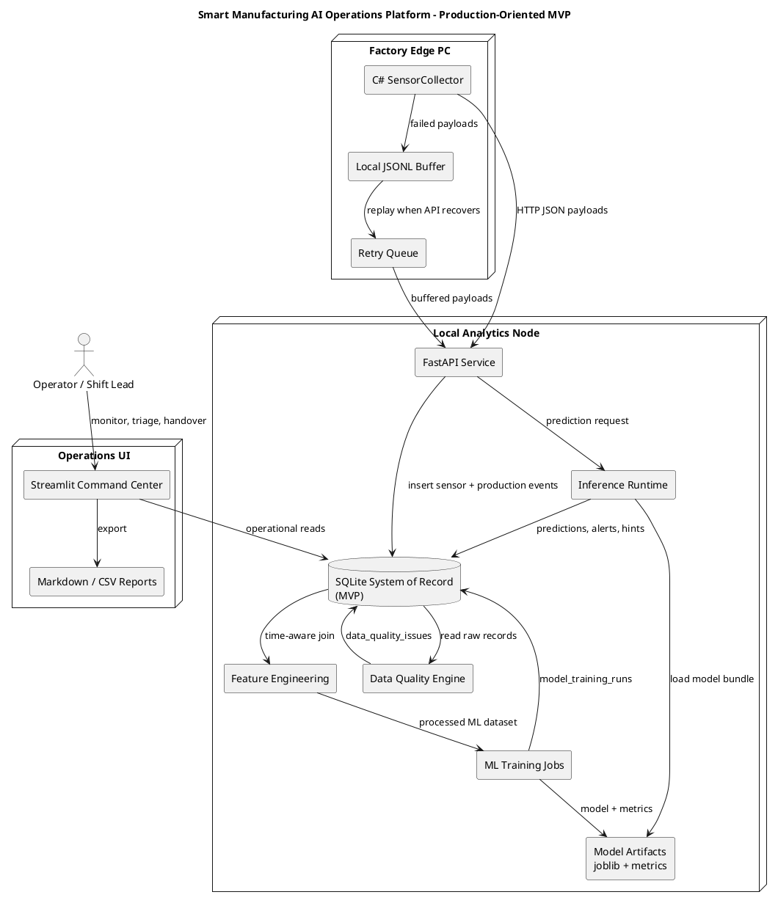
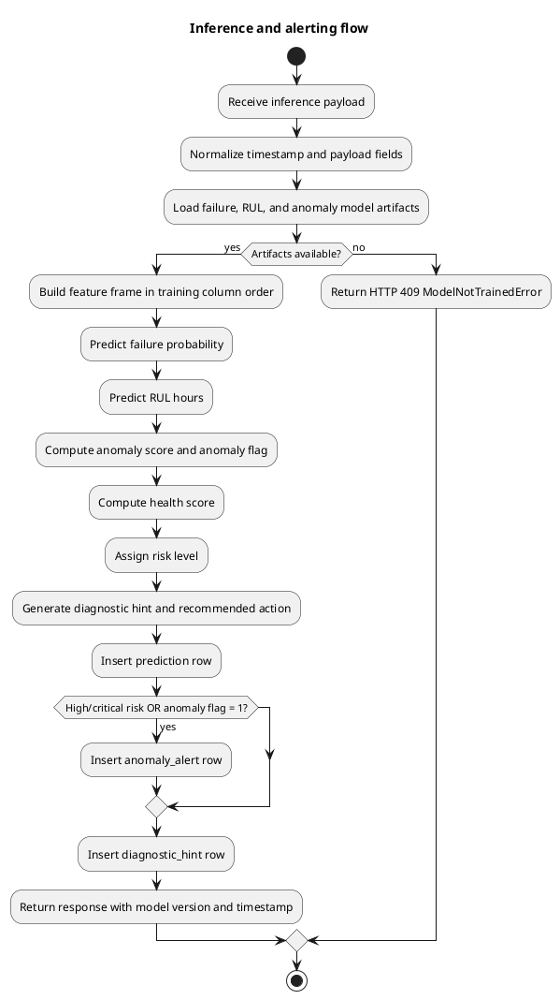
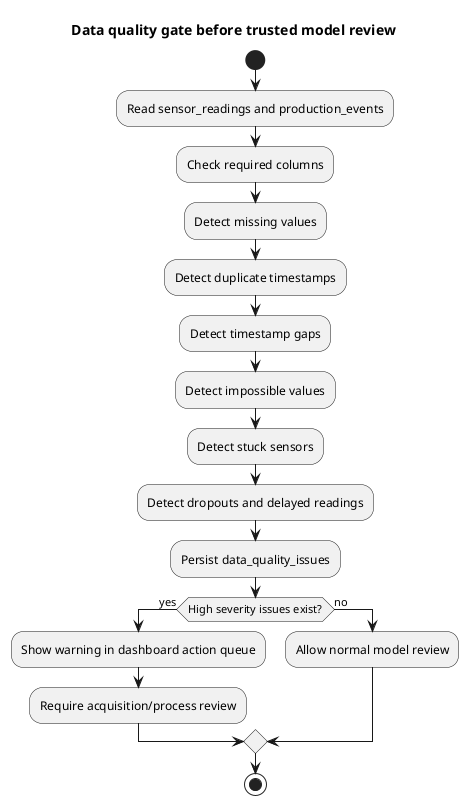

# SPEC-001-Production-Grade Smart Manufacturing AI Operations Platform

## Background

The original project already demonstrated a full industrial AI loop: C# acquisition, FastAPI ingestion, SQLite storage, data quality checks, feature engineering, model training, inference, health scoring, and Streamlit visualization.

This redesign raises the project from a technical demo into a closer-to-real operations platform. The intent is still honest and bounded: the system uses simulated data only, but the architecture, screen flow, operational language, runbook, schema, and API behavior now resemble what a manufacturing analytics team would build before integrating with real OT/IT infrastructure.

The design assumes a precision-electronics manufacturing environment with lines, stations, machines, production lots, shifts, maintenance events, data-quality checks, predictive maintenance signals, and operator-facing dashboards.

## Requirements

### Must have

- End-to-end runnable flow from data acquisition to dashboard without notebooks as the main execution path.
- Clear separation between edge acquisition, ingestion API, storage, ML jobs, inference, and visualization.
- Dashboard pages that feel like an operations command center rather than a collection of charts.
- A shift-handover style executive page with current risk posture and prioritized actions.
- Data-quality warnings surfaced before model outputs are trusted.
- Model registry visibility with training runs, artifacts, metrics, and feature importance when available.
- SQLite-compatible schema for local demonstration, including production-oriented indexes and views.
- Explicit simulated-data disclaimer throughout the package.
- Tests must continue to pass after the redesign.

### Should have

- Request correlation headers in API responses for troubleshooting.
- OpenAPI tags that separate health, ingestion, inference, and operations endpoints.
- Production-style architecture diagrams in PlantUML.
- Runbook notes that a contractor or junior engineer can follow without guessing.
- Exportable Markdown report that reads like a shift handover.

### Could have

- PostgreSQL deployment profile.
- OPC UA / MQTT ingestion adapter.
- Authentication and role-based dashboard pages.
- Job scheduler for preprocessing and model training.
- Real screenshot capture for portfolio documentation.
- Model drift and data drift monitoring.

### Won't have for MVP

- Real Seagate or proprietary factory data.
- Closed-loop machine control.
- PLC write-back.
- Certified safety-system behavior.
- Real predictive maintenance claims without plant validation.

## Method

### Production-oriented architecture



### MVP deployment topology

- `acquisition-csharp/SensorCollector`
  - Runs on a factory-edge PC or developer machine.
  - Sends sensor and production records via HTTP.
  - Buffers failed records to local JSONL and retries.

- `backend-python/api/main.py`
  - FastAPI service.
  - Owns ingestion endpoints, inference endpoints, health endpoint, and dashboard support endpoints.
  - Adds request IDs to responses for supportability.
  - Initializes SQLite with lifespan startup.

- `backend-python/src`
  - Contains repository, validation, preprocessing, feature engineering, model training, prediction, scoring, and diagnostics modules.

- `database/smart_manufacturing.db`
  - Local MVP system of record.
  - SQLite remains appropriate for an interview/demo environment.
  - A production rollout should replace it with PostgreSQL, historian integration, or a plant data platform.

- `dashboard/app.py`
  - Streamlit command center.
  - Designed around shift handover, action queue, line health, equipment health, anomaly triage, data quality, model registry, and report export.

### Core database schema

The MVP uses these operational tables:

```text
sensor_readings(event_id, machine_id, line_id, station_id, timestamp, sensor columns...)
production_events(event_id, line_id, station_id, timestamp, throughput/yield/downtime columns...)
data_quality_issues(issue_type, severity, entity_type, machine_id, line_id, station_id, timestamp, details_json)
model_training_runs(model_name, model_type, model_version, artifact_path, metrics_json, feature_columns_json, status)
predictions(machine_id, line_id, station_id, timestamp, failure_probability, rul_estimate_hours, anomaly_score, health_score, risk_level)
anomaly_alerts(machine_id, line_id, station_id, timestamp, anomaly_score, severity, message, source)
diagnostic_hints(machine_id, line_id, station_id, timestamp, hint, recommended_action)
```

Production-oriented additions:

```sql
CREATE INDEX IF NOT EXISTS idx_predictions_machine_ts
    ON predictions(machine_id, timestamp);

CREATE INDEX IF NOT EXISTS idx_predictions_line_risk_ts
    ON predictions(line_id, risk_level, timestamp);

CREATE INDEX IF NOT EXISTS idx_alerts_severity_ts
    ON anomaly_alerts(severity, timestamp);

CREATE INDEX IF NOT EXISTS idx_quality_severity_detected
    ON data_quality_issues(severity, detected_at);

CREATE VIEW IF NOT EXISTS vw_latest_machine_health AS
SELECT p.*
FROM predictions p
INNER JOIN (
    SELECT machine_id, MAX(timestamp) AS latest_timestamp
    FROM predictions
    WHERE machine_id IS NOT NULL
    GROUP BY machine_id
) latest
ON p.machine_id = latest.machine_id
AND p.timestamp = latest.latest_timestamp;

CREATE VIEW IF NOT EXISTS vw_line_operational_summary AS
SELECT
    pe.line_id,
    COUNT(*) AS production_event_count,
    AVG(pe.cycle_time_sec) AS avg_cycle_time_sec,
    AVG(pe.station_yield) AS avg_station_yield,
    SUM(COALESCE(pe.downtime_minutes, 0)) AS total_downtime_minutes,
    SUM(COALESCE(pe.reject_count, 0)) AS total_reject_count,
    MAX(pe.timestamp) AS latest_production_timestamp
FROM production_events pe
GROUP BY pe.line_id;
```

### Dashboard design method

The dashboard is organized as an operator workflow:

1. **Executive Overview**
   - Shows total machines, lines, critical machines, average health, anomaly count, and average RUL.
   - Adds a shift-handover action queue from latest predictions, anomaly alerts, and severe data quality issues.
   - Shows line health summary and latest operational data.

2. **Data Acquisition Status**
   - Shows last received timestamp, ingestion counts, failed count proxy, buffered proxy, and delayed readings.
   - Uses status pills to communicate active/stale/offline state.

3. **Line Monitoring**
   - Shows throughput versus target, cycle-time trend, station yield, reject/defect trends, micro-stops, and downtime.

4. **Equipment Health**
   - Shows machine-level failure probability, RUL, health score, risk level, sensor trends, recommended action, diagnostic hint, and prediction history.

5. **Process Anomaly**
   - Shows anomaly timeline, affected line/station, and diagnostic hints.

6. **Data Quality**
   - Shows missing values, duplicates, stuck sensor, timestamp gaps, dropout, impossible values, issue counts, and severity.

7. **Model Training & Registry**
   - Keeps training outside the dashboard process.
   - Shows run history, metrics JSON, and feature importance.

8. **Reports / Edge Deployment**
   - Exports CSV and Markdown report.
   - Documents edge deployment architecture and limitations.

### Inference algorithm



### Data-quality guardrail algorithm



## Implementation

1. Upgrade the dashboard visual system.
   - Add custom CSS, hero header, status pills, production-style metric cards, and sidebar run order.
   - Keep all dashboard data sourced from SQLite; do not add hardcoded results.

2. Add shift-handover logic.
   - Build an action queue from latest high/critical predictions, anomaly alerts, and severe data-quality issues.
   - Include action queue in the dashboard and Markdown report.

3. Harden API metadata and supportability.
   - Replace deprecated startup event with FastAPI lifespan initialization.
   - Add `x-request-id` response header middleware.
   - Add OpenAPI tags for health, ingestion, inference, and operations.

4. Extend SQLite schema for operational reads.
   - Add indexes for prediction, alert, and quality dashboards.
   - Add views for latest machine health and line operational summaries.

5. Improve architecture and readiness documentation.
   - Add this SPEC.
   - Add PlantUML diagrams.
   - Add production readiness matrix.
   - Update upgrade summary and README.

6. Validate.
   - Run `pytest -q`.
   - Confirm dashboard helpers still handle empty tables.
   - Confirm ingestion endpoint tests still pass.
   - Confirm model smoke training still produces artifacts.

## Milestones

| Milestone | Output | Acceptance criteria |
|---|---|---|
| M1 Dashboard polish | Updated `dashboard/app.py` | Loads empty DB safely, shows command-center header and action queue |
| M2 API hardening | Updated `backend-python/api/main.py` | Health and ingestion tests pass, no deprecated startup warning |
| M3 DB operational layer | Updated schema and repository initialization | SQLite initializes tables, indexes, and views |
| M4 Documentation | SPEC, diagrams, readiness matrix | Contractor can understand build path and limitations |
| M5 Validation | Test result | `26 passed` with existing suite |

## Gathering Results

The MVP should be evaluated with both system checks and operations checks.

### Engineering checks

- `pytest -q` passes.
- API `/health` returns `status = ok`.
- C# collector can post to `/ingest/sensor-reading` and `/ingest/production-event`.
- Preprocessing creates a processed ML dataset.
- Model training creates joblib artifacts and metrics JSON.
- Prediction endpoints write rows to `predictions`, `anomaly_alerts`, and `diagnostic_hints`.

### Dashboard checks

- Dashboard opens before data exists and shows clear empty states.
- Executive overview shows an action queue after predictions/alerts exist.
- Data Acquisition Status reflects record counts and freshness.
- Data Quality page shows persisted issues after preprocessing/checks.
- Model Registry shows model runs and metrics.
- Report export produces a readable Markdown shift-handover report.

### Production-readiness interpretation

This project is now a stronger production-style MVP, but it remains a simulated-data prototype. A real plant rollout requires real sensor integration, OT/IT architecture review, cybersecurity review, historian or message broker integration, plant-owner validation, model monitoring, and factory acceptance testing.

## Need Professional Help in Developing Your Architecture?

Please contact me at [sammuti.com](https://sammuti.com) :)
