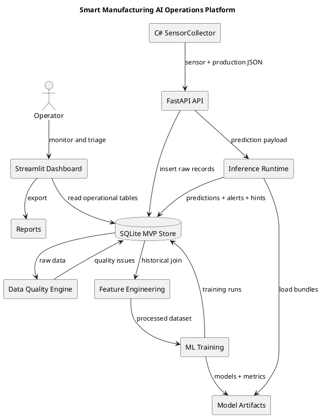

# Architecture

## Purpose

This document describes the upgraded Smart Manufacturing AI Operations Platform as a production-oriented MVP for industrial AI, predictive maintenance, and operations analytics.

The system still uses simulated data only. The redesign focuses on credible architecture, realistic operational flow, clear boundaries, and a dashboard that resembles a manufacturing command center.

## Architecture principles

1. **Runnable before impressive** — every layer should execute from scripts or services, not only from notebooks.
2. **Operational honesty** — all simulated-data limitations remain visible.
3. **Separation of concerns** — data acquisition, ingestion, storage, ML jobs, inference, and UI have clear ownership.
4. **No hidden future leakage** — feature engineering uses historical records only.
5. **Human-readable operations** — dashboard and reports are written for shift leads, maintenance engineers, and data engineers.
6. **Replaceable MVP storage** — SQLite is the local system of record for the demo, but the schema maps cleanly to PostgreSQL or a historian-backed architecture.

## High-level flow

```text
Factory Edge / C# SensorCollector
  -> FastAPI ingestion
  -> SQLite system of record
  -> Data quality checks
  -> Timestamp-safe feature engineering
  -> ML training and model registry
  -> FastAPI inference
  -> Health score, alerts, diagnostic hints
  -> Streamlit operations command center
  -> CSV / Markdown report export
```

## Component responsibilities

### C# Data Acquisition

The collector represents an edge acquisition process. It reads configuration, generates or collects sensor and production events, posts JSON payloads to FastAPI, writes failed payloads to a local JSONL buffer, and retries later.

Production analogue: edge PC, line-side gateway, or small acquisition service near equipment.

### FastAPI service

FastAPI provides:

- `/health`
- `/ingest/sensor-reading`
- `/ingest/production-event`
- `/ingest/batch`
- `/predict/failure`
- `/predict/rul`
- `/detect/anomaly`
- `/data-acquisition/status`
- `/model-runs`
- `/predictions`
- `/alerts`
- `/line-health/{line_id}`

Production-style changes:

- Lifespan startup initializes local storage.
- API responses include an `x-request-id` header for supportability.
- OpenAPI tags separate health, ingestion, inference, and operations endpoints.

### SQLite system of record

SQLite is the MVP store for local demonstration. It stores:

- raw sensor readings
- production events
- data quality issues
- model training runs
- model artifacts
- predictions
- anomaly alerts
- diagnostic hints
- report metadata
- synthetic source tables

Production analogue: PostgreSQL, data historian, MES/quality database, Kafka/MQTT pipeline, or cloud industrial data platform.

### Data quality engine

The quality engine detects:

- missing required columns
- missing values
- duplicate timestamps
- timestamp gaps
- impossible sensor or production values
- stuck sensors
- dropouts
- delayed readings

The dashboard surfaces quality issues before users trust model recommendations.

### Feature engineering

Feature engineering joins sensor and production records using a backward time-aware join. Rolling features use historical values only. Target columns and hidden simulation state are excluded from training features.

### ML pipeline

The pipeline trains:

- failure classifier
- RUL regressor
- IsolationForest anomaly detector

Artifacts are saved as joblib files and registered with metrics, feature columns, row counts, and status.

### Inference runtime

Inference loads model artifacts, normalizes payloads, builds the training feature layout, returns failure probability, RUL estimate, anomaly score, anomaly flag, health score, risk level, diagnostic hint, and recommended action. It also persists prediction history, alerts, and hints.

### Streamlit command center

The dashboard is designed around production operations:

- shift-handover action queue
- line health
- acquisition status
- equipment health
- process anomalies
- data quality
- model registry
- report export
- edge deployment notes

## PlantUML component diagram



## Data policy

This project uses simulated data only.

It does not use real Seagate data, proprietary factory data, real customer data, or real equipment signals. It is not a certified control system and must not be described as a deployed factory system.
